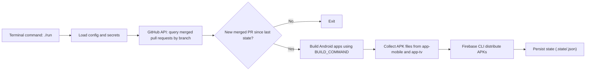

# OTT Clouds Android Distribution Pipeline (English)

```mermaid
flowchart LR
    A["Terminal command: ./run"] --> B["Load config and secrets"]
    B --> C["GitHub API: query merged pull requests by branch"]
    C --> D{"New merged PR since last state?"}
    D -- "No" --> E["Exit"]
    D -- "Yes" --> F["Build Android apps using BUILD_COMMAND"]
    F --> G["Collect APK files from app-mobile and app-tv"]
    G --> H["Firebase CLI distribute APKs"]
    H --> I["Persist state (.state/<branch>.json)"]
```
